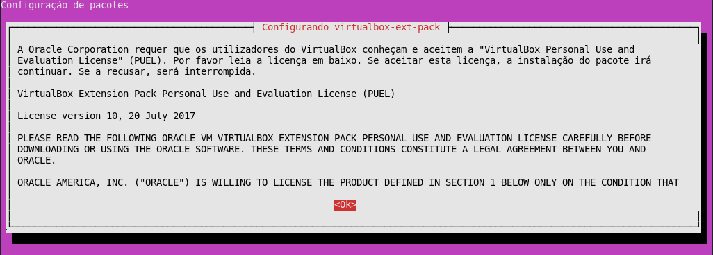
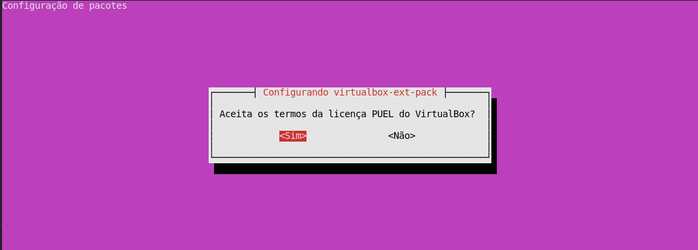
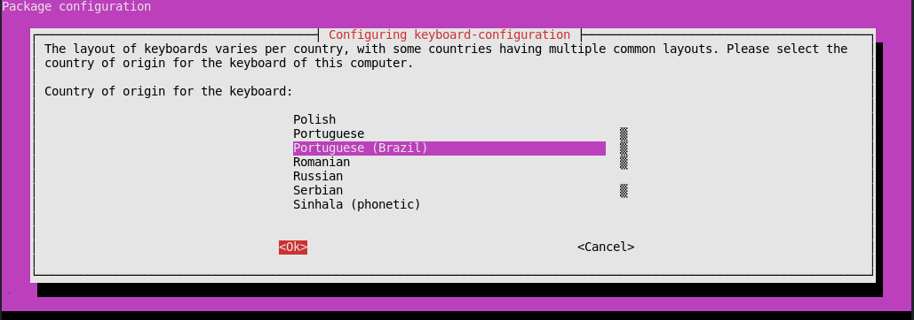
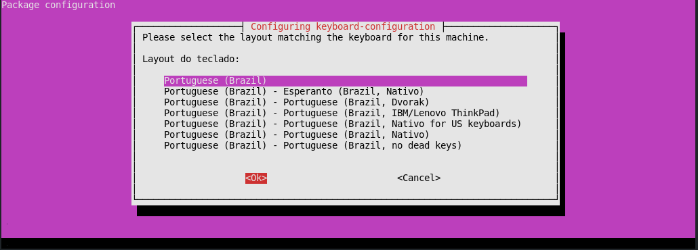
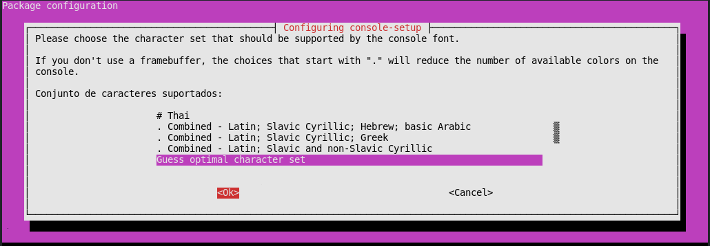
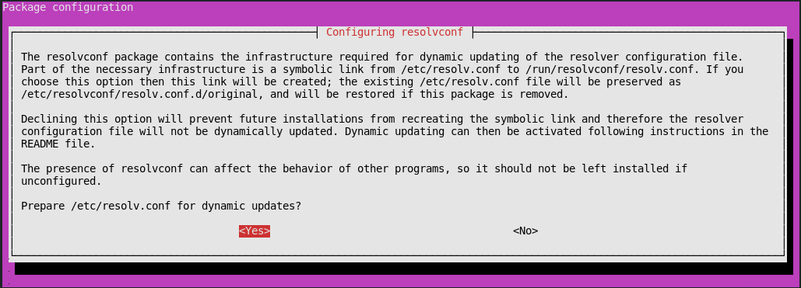
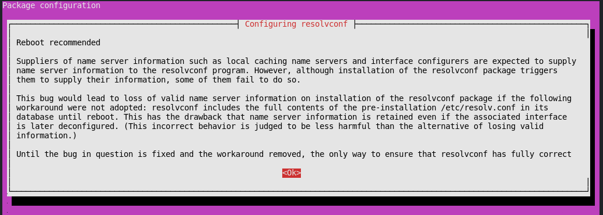
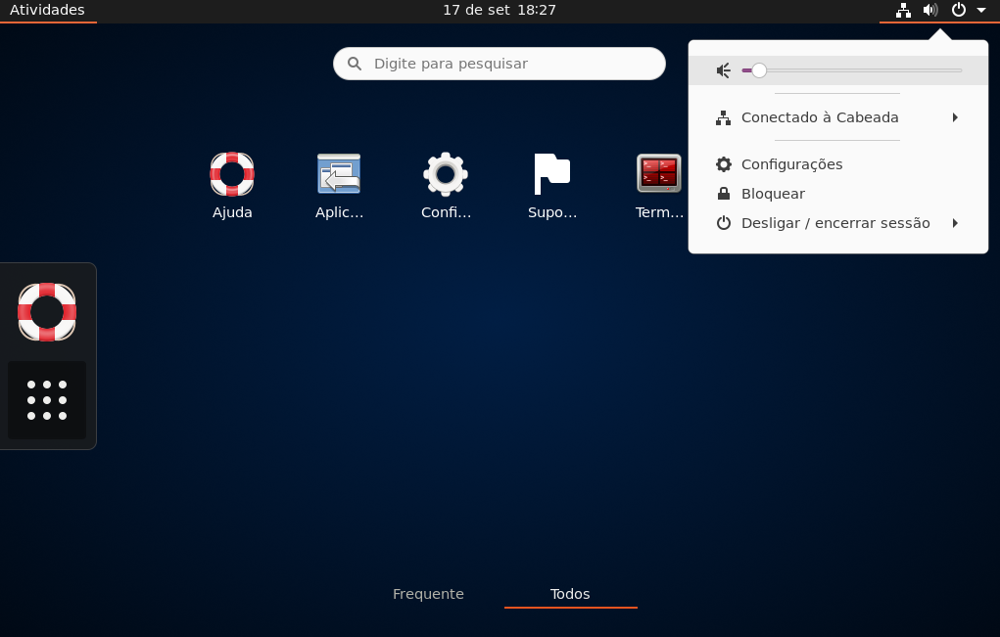

# NEORICALEX

## Apresentação

O [NEORICALEX](https://neoricalex.com.br) é a minha Plataforma e/ou Ambiente de Trabalho. O local onde eu condenso tudo o que eu sei fazer em TI.

A ideia de criação do NEORICALEX surgiu de uma necessidade minha pessoal quando, em Fevereiro 2020 eu fiquei desempregado com a pandemia do COVID19. Foi preciso encontrar uma forma de pagar as contas ao final do mês, e, decidi de monetizar meu conhecimento trabalhando em meu próprio projeto pessoal.

O NEORICALEX é um framework de trabalho com 3 ambientes:
* Ambiente de Desenvolvimento
* Ambiente de Homologação
* Ambiente de Produção

A minha ideia principal para o projeto é criar os 3 ambientes com apenas um comando.

Para conseguir chegar nesse objetivo, eu decidi de criar uma Distribuição Linux do Zero. Enfim, quase do zero. Na verdade isso é o meu "sonho". Por enquanto preciso monetizar. Então eu optei por seguir o atalho de criar um "Ubuntu from scratch".

Por outras palavras, eu não comecei no Assembly. Comecei bem mais na frente, criando uma versão customizada do Ubuntu 20.04 do completo zero. Dessa forma economizo um bom tempo.

O NEORICALEX pode ser visto como:

* Uma ferramenta para criar uma Distribuição Linux do Zero baseada no Ubuntu.
    * Nessa Distribuição a que dei o nome **NFDOS**, existe, ou vai existir:
        * Uma Firewall
        * Um Proxy Reverso
        * Um Load Balancer
        * Um Cluster LXC/LXD
        * Um Cluster Docker
        * Uma VPN
        * E muito mais...
* Uma ferramenta para criar um ambiente de desenvolvimento no Vagrant, tendo o NFDOS como sistema operativo padrão.
* Uma ferramenta para criar um ambiente de homologação no VirtualBox, tendo o NFDOS como sistema operativo padrão.
* Uma ferramenta para criar um ambiente de produção na Cloud (Google, IBM, Digital Ocean), tendo o NFDOS como sistema operativo padrão.

O detalhe é, como já comentei, eu quero que tudo seja feito com um único comando.
    
Mas é claro, ainda não chegamos lá. Leia o [README do NFDOS](./dev/iso/README.md) para saber qual é o ROADMAP.

## Início Rápido

```bash
# Instalar o Git
sudo apt install git -y

# Clonar o NEORICALEX
git clone https://github.com/neoricalex/neoricalex.git

# Entrar na pasta neoricalex
cd neoricalex

# Iniciar o NEORICALEX
bash shell
```
Durante o processo de criação da ISO é necessário alguma interatividade.

Logo no inicio do processo é necessário que forneça sua senha de *root*, para que seu computador seja atualizado e para que os requerimentos possam ser instalados.

Depois vai aparecer a tela dos termos da licença do VirtualBox da Oracle (imagem abaixo):



Carregue na tecla *TAB* para selecionar o *OK*, e carregue na tecla *ENTER* para continuar.



E aqui *TAB* para selecionar o *Sim*, e carregue na tecla *ENTER* para aceitar os termos e continuar.



Depois com setas "*Cima/Baixo*" selecione o *Portuguese* ou *Portuguese(Brazil)*, tecla *TAB* para selecionar o *OK*, e *ENTER* para continuar.



Tela seguinte é referente ao teclado. De igual forma setas "*Cima/Baixo*" selecione o *Portuguese* ou *Portuguese(Brazil)*, tecla *TAB* para selecionar o *OK*, e *ENTER* para continuar.



Tela seguinte é referente à fonte da consola. Igual, setas "*Cima/Baixo*" selecione o *Guess optimal character set*, tecla *TAB* para selecionar o *OK*, e *ENTER* para continuar.



Nesta tela já é referente à configuração da rede. Tecla *TAB* para selecionar o *Yes* e tecla *ENTER* para continuar.



Nesta tela é apenas a informação de que teremos de reiniciar o pc. No caso estamos a criar uma imagem ISO, então a informação é "inútil" para nós. Seja como fôr, vamos continuar com a tecla *TAB* para selecionar o *OK* e *ENTER* para continuar.

Após passar esta etapa, nada mais vai ser preciso de sua parte. A única excepção é referente à senha de *root*, que poderá ser pedida novamente quando for necessário entrar no *CHROOT* do NFDOS, e/ou, na fase de criação da ISO própriamente dita. Porém aqui já depende do tempo que seu computador fica com a senha sudo ativa. Então pode ser até que nem peça mais a senha.

De momento, quando a imagem ISO do NFDOS estiver criada, uma máquina virtual será criada no VirtualBox, máquina essa que será iniciada automáticamente já com o sistema "Live" do NFDOS Desktop funcionando.

Como nada foi feito ainda no *initrd*, o sistema Live NFDOS Desktop nada mais é que uma versão simplificada do Live CD do Ubuntu 20.04. No entanto, por enquanto sem o ZFS, pois a licença da Oracle não me permite de distribuir uma ISO já com o ZFS instalado.

Abaixo um print screen depois de instalar **manualmente** o NFDOS Desktop na VM:



Mais na frente, o Workflow será ligeiramente diferente, pois o objetivo é automatizar tudo, incluindo a instalação na VM. Mas para já é isso :-)

Divirta-se !

## Documentação

A documentação está provisóriamente acessível através do [Read The Docs](https://neoricalex.readthedocs.io). Ainda está bem "crua", mas só tenho 2 braços e 5 dedos em cada mão :-)

## Financiamento

Gostou do projeto, e está afim de ajudar seu desenvolvimento financeiramente?
Ajude via [Paypal](https://www.paypal.me/AleexFL).

Obrigado desde já pelo "café" :-)

## Notas de Lançamento e/ou Atualizações

### NEORICALEX

#### Ambiente de Desenvolvimento (Vagrant)
* O código fonte para a criação da box do Vagrant está pronto, mas ainda falta configurar a ISO de forma a automatizar a criação da box.

#### Ambiente de Homologação (VirtualBox)
* O código fonte para a criação de uma máquina virtual com a imagem ISO do NFDOS está pronto.

#### Ambiente de Produção (Cloud){Digital Ocean, Google Cloud, IBM, Etc...}
N/A

### NFDOS

#### NFDOS Desktop
* **Versão 0.3**
    * Agora temos uma versão e/ou imagem *.box* para o Vagrant
    * Novidades da Imagem e/ou versão *.iso*:
        * O *Terminator* foi instalado para termos um emulador de terminal para trabalhar.
    * Novidades da Imagem e/ou versão *.box*:
        * Leia as Notas de Lançamento do NEORICALEX no Ambiente de Desenvolvimento
* **Versão 0.2**
    * Agora podemos instalar o sistema no disco.
    * Além disso a GUI está completamente zerada, nem mesmo um terminal tem. Apenas tem internet e as configurações do Gnome.
* **Versão 0.1**
    * Compilação da ISO do Live CD
        * Dá para usar, mas não dá para instalar no disco para termos persistência, e não precisarmos da imagem ISO.
#### NFDOS Server
N/A

## Licença

[LICENÇA PÚBLICA GERAL GNU (Versão 2, junho de 1991)](./LICENSE)
